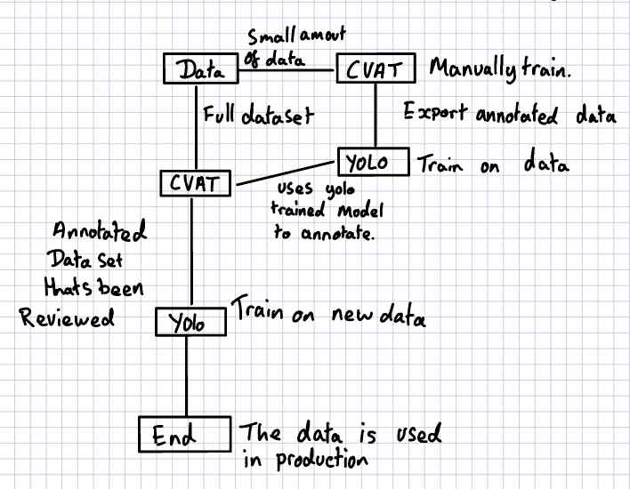

# Computer Vision  

## Tools:  
  
- CVAT  
- YOLO  
- OpenCV  
  
## CVAT  
  
### What is it?  
  
CVAT is our way of annotating images so that they can be used to train our YOLO model. The anotation can be done either manually done or it can be done by a AI model like YOLO. The plan for this is to manually train a small dataset for the AI to learn so that it can shift through a much larger data set.  
  
### How to use?  
  
The set up is complete and there will be a guide on how to set it up at a future date. But for the mean time it's running in a docker container on bigboi. To access go on a browser and go to http://localhost:8080 and you will be in the dashboard. The container is currently always running so there is no need to turn it on and off.  
  
For info on how to use look at https://docs.cvat.ai/docs/  
  
### How does it Apply to our needs?
  
Automation. The aim with cvat is to reduce the time we need to spend anotating images for YOLO.  
  
## YOLO  
  
### What is it?  
  
YOLO (You Only Look Once) is a real-time computer vision AI model that can process an entire image and detect and claasify targets. This is different to other computer vision as they use a algorithm that runs over the image a few times so that they can detect and claasify targets.  
  
### How to Set Up?  
  
I would recomend installing the pip packages in a venv as you might run into packages not cooperating. Commands to set up venv and packages will be at the bottom of this readme.  
  
### How to use?  
  
I would recomend reading the documentation which is here: https://docs.ultralytics.com/  
But the run down would be we have a model that the code will refer to.  
  
### How does it apply to our needs?  
  
It gives us the ability to detect objects quicker and supposedly with harder edge cases that we might run into that openCV might struggle with.  
  
## OpenCV
  
### What is it?  
  
OpenCV is a computer vision package that we can use to detect things. Unlike YOLO we have to define said things to detect.  
  
### How to Set up?  
  
I would recomend installing the pip packages in a venv as you might run into packages not cooperating. Commands to set up venv and packages will be at the bottom of this readme.  
  
### How to use?  
  
I once again would read the documentation found here: https://docs.opencv.org/4.x/pages.html  
In the future there might be example code.  
  
### How does it apply to our needs?  
  
It gives us redundency when we are doing detection. If YOLO does not detect then we can fall back on openCV. It can also be used depending as a replacement for YOLO in the case of YOLO not working or that it's not worth the extra computational power.  
  
## Commands  
  
These are all currently in mind for Python:  

### Install  
  
```Bash
python -m venv cv_env
source cv_env/bin/activate
pip install opencv-python ultralytics cvat-sdk
```  
  
### Activation and Deactivation of venv.  
  
#### Activate  
  
``` Bash
source cv_env/bin/activate
```  
  
#### Deactivate  
``` Bash
deactivate
```  

# Pipline Plan  
  
The diagram rely's on the data already being gathered.

